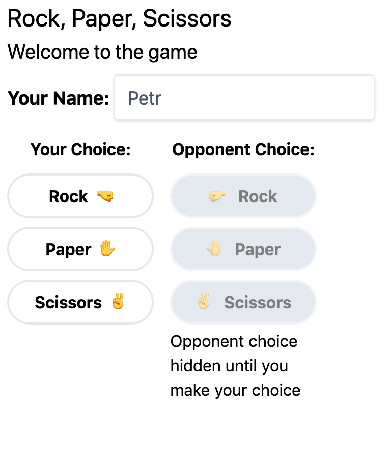
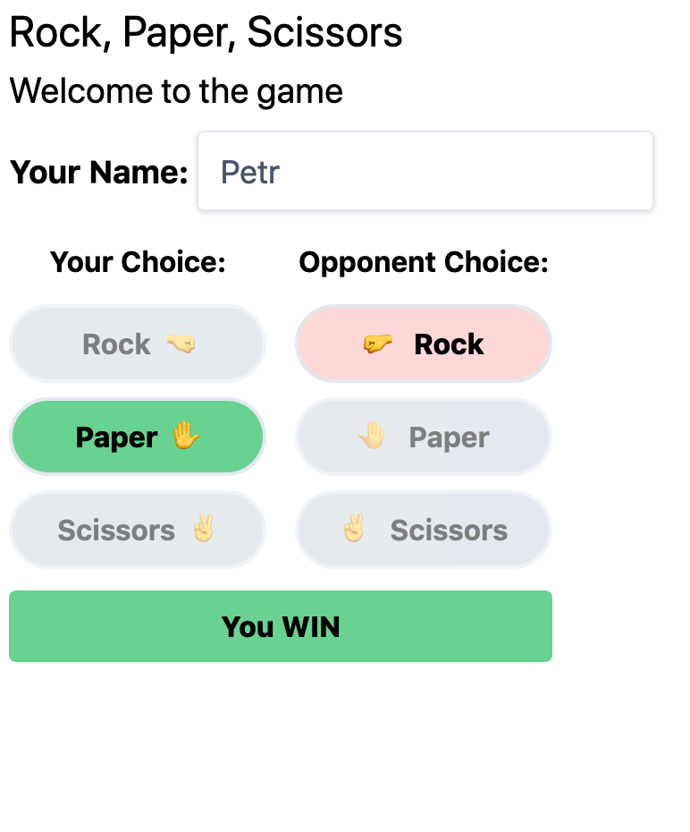

# Laravel Livewire - Камень, ножницы, бумага

Пишу игру «Камень, ножницы, бумага» с помощью **Laravel Livewire** и расскаызаю об этом в серии скринкастов: https://www.youtube.com/playlist?list=PLvP6XNj3GUhB4idkTp1KPBki3-070Ymcq

[Livewire](https://github.com/livewire/livewire) позволяет создавать динамические веб-интерфейсы без программирования на JavaScript. Весь код будем писать исключительно на PHP, при этом приложение будет работать без перезагрузки страницы и общаться с сервером с помощью Ajax.

Пятиминутка PHP - подкаст о PHP, DBA, архитектуре, DevOps. Авторское мнение о современных трендах в веб-разработке и интересные беседы с гостями. https://5minphp.ru

